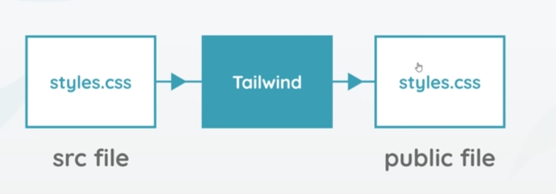
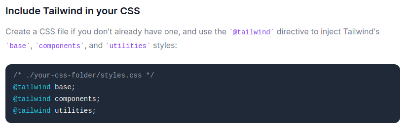

# Tailwind.css


## Intro and Setup

It is a CSS framework made up of utility classes. It is much lower than Bootstrap, Materialize etc. In Bootstrap you get the components, but tailwind.css gives you classes with which you can build those components. Bootstrap websites can be identified by looking at the source code, but a tailwind.css website would be more difficult to identify.

### Setup

Install Tailwind using npm in your project. You will need [node.js](nodejs.org/en/) installed on your computer.

Run below command to check the version of node.

```bash
node -v 
```

Create a folder, open terminal in that folder location. And initialize npm which will create the package.json file:

```bash
npm init -y
```

Install tailwindcss dependency

```bash
npm install tailwindcss
```

## How does Tailwind.css work



You can tailwind.css on its own, or you can use it as plugin with post.css. We will use it on its own. styles.css is where tailwind stuff is stored, we can also add to it. Then tailwind processes it into an output vanilla css file. Very rarely, do we have to change the source css. 

We will have to create a source folder and a public folder. The CSS we write with tailwind will go in source folder. The public folder is where the processed output CSS will go to. The public folder is what gets deployed.

styles.css in the source directory needs to be injected with tailwindcss directives. 

https://tailwindcss.com/docs/installation




## Tailwind.css Resources

Make blocks and get the code: https://devdojo.com/tails/app#_=_
https://www.producthunt.com/posts/tails-2

Blocks: https://tailblocks.cc/

https://dev.to/mariann93502220/15-awesome-tailwind-css-templates-and-themes-55jh

Paid with some free samples: https://tailwindui.com/

Collection: https://github.com/aniftyco/awesome-tailwindcss

Chunks: https://tailwindchunks.github.io/tailwindchunks/components/toast

https://codepen.io/collection/XLxkyK/
